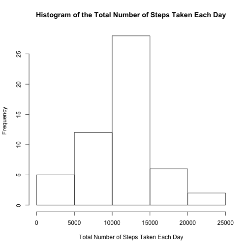
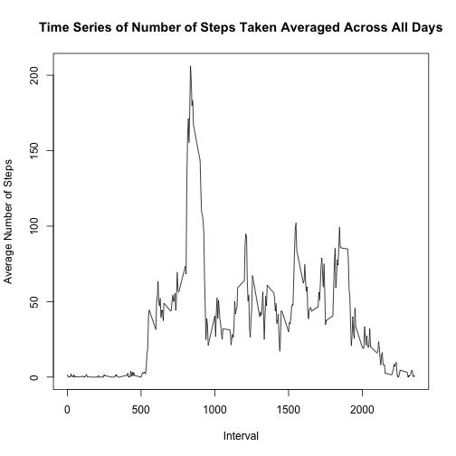
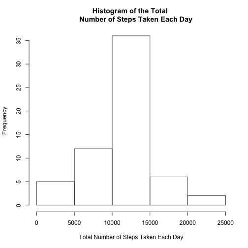
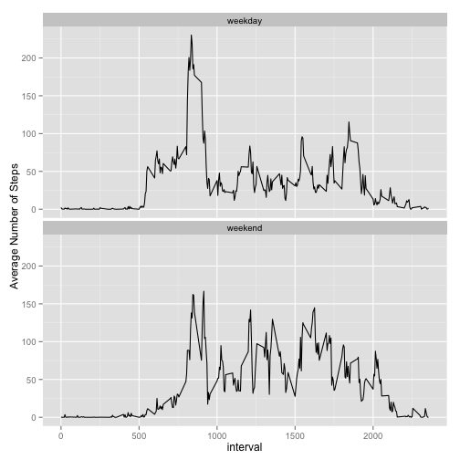

  
Load the dplyr, lubridate and ggplot2 libraries. Read in the data and omit records with NA. 


```r
library(dplyr)
library(lubridate)
library(ggplot2)

activity <- read.csv("activity.csv", header = TRUE)
```
  
### Analysing data with NA records omitted.

We first omit the NAs in the records.


```r
data <- na.omit(activity)
```

To check the frequency for every total number of steps each day, we calculate the total steps for each day and a histogram is constructed as below:


```r
data_totalsteps <- summarize(group_by(data, date), total.steps = sum(steps))
hist(data_totalsteps$total.steps, main = "Histogram of the Total Number of Steps Taken Each Day",
     xlab = "Total Number of Steps Taken Each Day")
```

 

To calculate the mean and median of average steps:


```r
mean_steps_omit <- mean(data_totalsteps$total.steps)
median_steps_omit <- median(data_totalsteps$total.steps)
```

The mean total number of steps taken per day is 1.0766189 &times; 10<sup>4</sup>. The median total number of steps taken per day is 10765.

To make a time series plot of the 5-minute interval (x-axis) and the average number of steps taken, averaged across all days (y-axis), we first calculate the mean for each interval across all days using the summarize function.


```r
data_avgsteps <- summarize(group_by(data, interval), avg.steps = mean(steps))
```
The time series plot of the average number of steps across all days over the interval is:


```r
plot(unique(data$interval), data_avgsteps$avg.steps, type = "l", 
     main = "Time Series of Number of Steps Taken Averaged Across All Days",
     xlab = "Interval", ylab = "Average Number of Steps")
```

 

To extract the interval where the max average step occurs
:

```r
max_interval <- select(filter(data_avgsteps, avg.steps == max(avg.steps)), interval)
```
The interval that contains the maximum number of steps on average across all the days in the dataset is 835  
  

### Analysing the data with records with NA values replaced.


```r
missing <- length(which(is.na(activity$steps)))
```

The total number of missing values in the dataset (i.e. the total number of rows with NA) is 2304

In this segment, we replace missing values in the dataset with the mean for that 5-minute interval. To do this, we create a dataset "data_complete" that is equal to the original dataset but with the missing data filled in with the average steps of the interval over all days. "data_complete", like the original contains the variables "interval", "steps" and "date".


```r
activity <- merge(activity, data_avgsteps, by = "interval", sort = FALSE)
activity$steps[is.na(activity$steps)] <- activity$avg.steps[is.na(activity$steps)]
data_complete <- select(activity, c(interval, steps, date) )
```

Next calculate the total steps across the dates. Then, we make a histogram of the total number of steps taken each day and calculate and report the mean and median total number of steps taken per day. 


```r
data_complete_totalsteps <- summarize(group_by(data_complete, date), total.steps = sum(steps))
hist(data_complete_totalsteps$total.steps, main = "Histogram of the Total 
     Number of Steps Taken Each Day",
     xlab = "Total Number of Steps Taken Each Day")
```

 

It is observed that the overall frequency derived from the dataset with the NAs replace is slightly higher than the dataset with NAs omitted. This is especially true for total steps ranging between 10,000 and 15,000. As such, the total daily number of steps is now higher.

To calculate the mean and median of average steps:


```r
mean_steps_replaced <- mean(data_complete_totalsteps$total.steps)
median_steps_replaced <- median(data_complete_totalsteps$total.steps)
```
The mean total number of steps taken per day is 1.0766189 &times; 10<sup>4</sup>. The median total number of steps taken per day is 1.0766189 &times; 10<sup>4</sup>.

To create a new factor variable in the dataset with two levels – “weekday” and “weekend” indicating whether a given date is a weekday or weekend day, we first create a dataframe "df_weekday" that matches the ID of the days of the week to whether they are weekday or weekend. Note that the day column is set as a factor variable by default. Next we convert the dates in the dataset into their corresponding ID using the wday function and merge it with "df_weekday".  


```r
df_weekday <- data.frame(c(1:7), c("weekend", rep("weekday", 5), "weekend"))
colnames(df_weekday) <- c("day.id", "day")
data_complete <- mutate(data_complete, day.id = wday(ymd(data_complete$date)))
data_complete <- merge(data_complete, df_weekday, key = "day.id")
```

Next we make a panel plot containing a time series plot (i.e. type = "l" ) of the 5-minute interval (x-axis) and the average number of steps taken, averaged across all weekday days or weekend days (y-axis). First we calculate the average steps for each interval and day.


```r
data_complete_day <- summarize(group_by(data_complete, interval, day), avg.steps = mean(steps))
g <- ggplot(data_complete_day, aes(interval, avg.steps))

## Add layers
g + geom_line() + 
        facet_wrap( ~ day, nrow = 2, ncol = 1) +
        labs(y= "Average Number of Steps")
```

 

